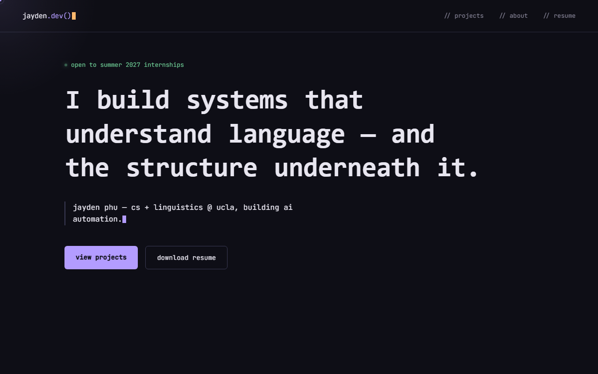

# jayden.dev()

Personal portfolio site for Jayden Phu — CS + Linguistics @ UCLA. Project case
studies, resume, and contact.

### **[→ jaydenphu.dev](https://jaydenphu.dev)**



Built with [Astro](https://astro.build): case studies are plain Markdown, every
page shares one layout, and the whole site ships as static HTML.

## Commands

| Command           | Action                               |
| ----------------- | ------------------------------------ |
| `npm install`     | Install dependencies                 |
| `npm run dev`     | Dev server at `localhost:4321`       |
| `npm run build`   | Production build to `./dist/`        |
| `npm run preview` | Preview the production build locally |

## Structure

```
src/
  consts.ts               site-wide constants (name, email, social links)
  content.config.ts       schema for the projects collection
  content/projects/       case studies — one Markdown file each
  layouts/Base.astro      shared shell: head/SEO, nav, footer, custom cursor
  components/             ProjectCard
  pages/                  index (hero, projects, about, skills), 404, projects/[slug]
  styles/global.css       the whole design system
public/
  resume.pdf              served at /resume.pdf (stable path)
  og-image.png            social share card
  favicon.svg
```

To add a case study, drop a new `.md` file in `src/content/projects/` with the
same frontmatter shape as the existing ones — it gets a card on the home page
and its own page automatically.
